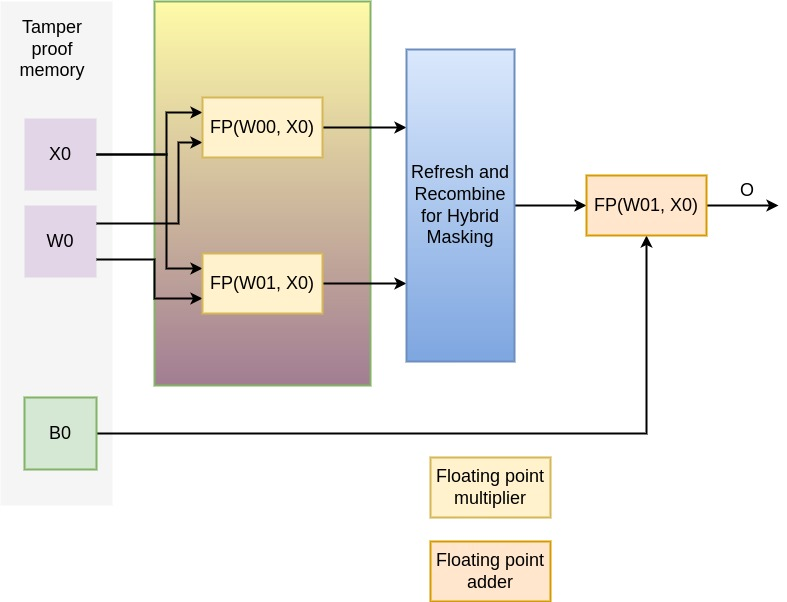
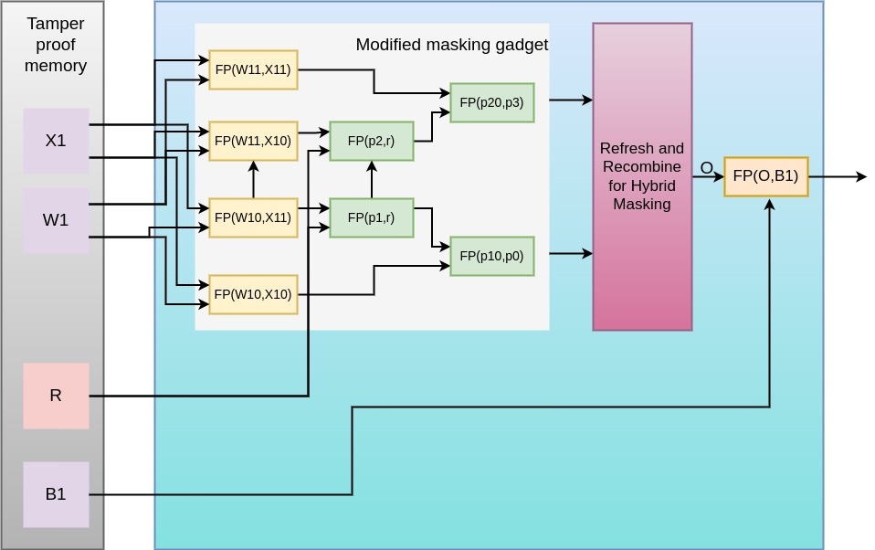

# Protecting-ML-models-via-Masking

Attacks like Differential Power Analysis(DPA) exploit the correlation between the secret key-dependent data and power consumption of the device.Edge-based ML accelerators are susceptible to these attacks as the adversary has physical access to the device and hence, applying physical side-channel attacks is comparatively easier.The differences between ML and cryptographic algorithms cause challenges when adapting side-channel defenses towards ML. My work uses a well-known defense technique known as Masking. Weights and biases are the critical parameters of an ML model that I will be aiming to protect via masking. This countermeasure splits the original parameter into multiple statistically independent shares to break the correlation of secret data with power consumption.

# Motivation
The growing shift of ML models to edge devices like surveillance cameras to directly provide models as a service to the customer for better performance and privacy makes them vulnerable to power-side channel attacks. To date, the defense techniques discussed to protect neural networks have mainly focused on masking the inputs of the neural network or the hardware components like adder and multiplexer[DAP+22]. There is no countermeasure for masking of weights due to their huge size, hence masking all the weights throughout the network is unfeasible. One of the approaches can be the masking of the selective weights depending on the impact they have on the accuracy of the neural network.

# Objective
Performing sensitivity analysis of weights which helps in ranking them based on their influence on the neural network’s prediction by measuring changes in output when specific weights are perturbed. Then apply the most suitable masking technique on the higher ranked weights.

# First Layer Architecture Diagram

# Second Layer Architecture Diagram

# Conclusion
The current work I have done so far is to understand how the power side channel attacks hamper the security of edge based ML devices. The thorough survey of defense techniques employed till date to protect the critical parameters of the neural network drew my attention towards unexplored technique of masking the weights of the model instead of inputs. Most importantly masking the partial weights, as masking all weights leads to huge overhead. In order to decide which weights to be masked, I ranked them using several techniques. Then, after discovering various masking techniques and picking the most suitable one for my idea, I proposed two architectures of the masking procedure based on the experimental analysis and specific layers of the model.
